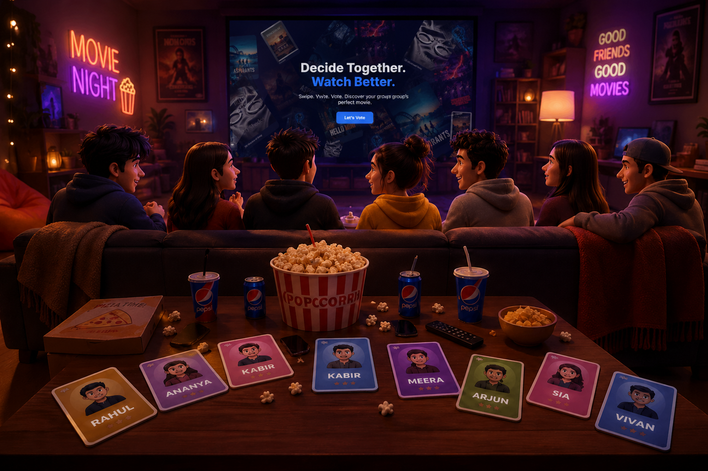

# 🎬 Scene Kya Hai?

> **Friends decide. Votes collide. One movie wins.**

---

## 📖 About

**Scene Kya Hai?** is a fun, interactive movie voting web app that helps friends decide what to watch together — without the arguments.

Each player swipes through movie suggestions from the group. The app tallies all the votes and reveals the winning movie in a cinematic podium reveal experience. No backend. No setup. Just pure movie-night vibes.

---

## 📸 Preview



---

## ✨ Features

| Feature | Description |
|---|---|
| 🎬 **Swipe Voting** | Right = Like · Left = Dislike · Up = Love |
| 👥 **Multi-Player** | Turn-based voting for up to 5 players |
| 🃏 **Floating Cards** | Gesture-controlled cards with GSAP animations |
| 🎭 **Cinematic UI** | Immersive movie-room interface |
| 🎥 **Countdown** | Dramatic countdown video before results |
| 🏆 **Podium Reveal** | Sports-style winner announcement with confetti |
| 💾 **No Backend** | Fully powered by localStorage |

---

## 🛠️ Tech Stack

- **Frontend:** React · HTML · CSS · JavaScript
- **Animations:** GSAP · CSS Keyframes
- **Storage:** localStorage (no backend required)
- **Build Tool:** Vite

---

## 🚀 How It Works

```
1️⃣  Add Players  →  Each player enters their name + movie suggestions
2️⃣  Start Voting  →  Players take turns swiping through all suggestions
3️⃣  Vote        →  Swipe right (Like), left (Dislike), or up (Love)
4️⃣  Countdown   →  Dramatic countdown plays after all votes are cast
5️⃣  Results     →  Cinematic podium reveals the winner 🏆
```

---

## 🔢 Scoring System

| Swipe | Vote | Points |
|---|---|---|
| ↑ Up | LOVE | 3 pts |
| → Right | YES | 1 pt |
| ← Left | NO | 0 pts |

The movie with the **highest total points** wins.

---

## 🏃 Getting Started

```bash
# Install dependencies
npm install

# Run the development server
npm run dev
```

Then open [http://localhost:5173](http://localhost:5173) in your browser.

---

## 🔮 Future Improvements

- 🌐 Real-time multiplayer (WebSocket / backend integration)
- 🔗 Online room sharing via invite link
- 🔐 User authentication system
- 📱 Native mobile app (React Native)

---

## 👤 Author

**Bhavesh** — [GitHub](https://github.com/Bhavesh1411)

---

<p align="center">Made with ❤️ for movie nights that actually end with a decision.</p>
